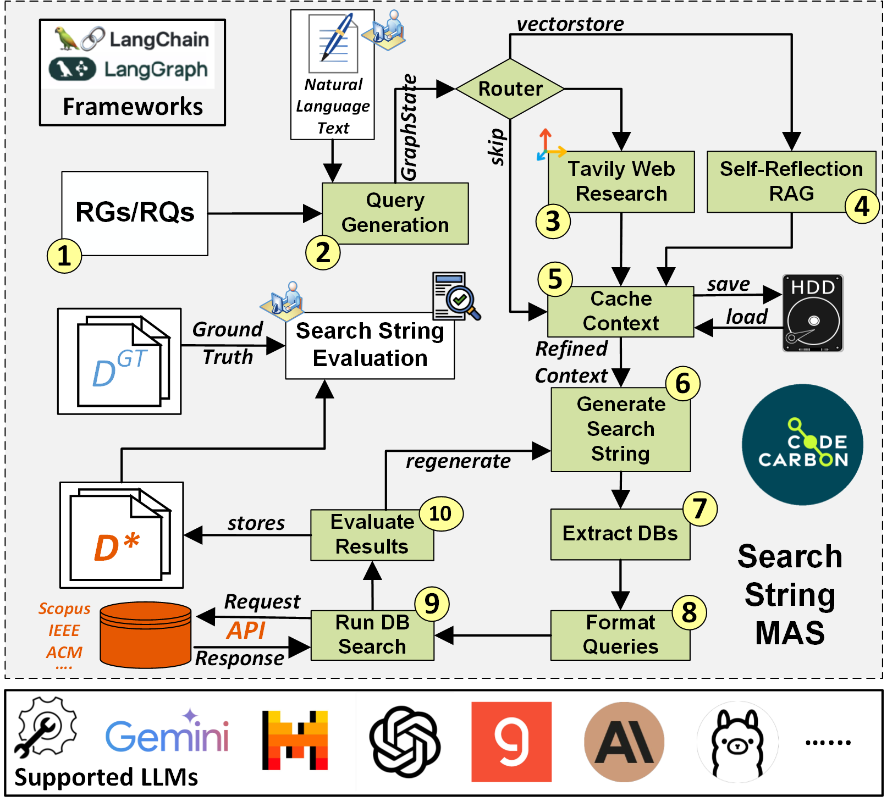

# S2G-MAS-SR Replication Package

**From Search String Generation to Study Selection: A Multi-Agent Generative AI Framework for Systematic Reviews**  

### Submitted to ASE Conference 2025

---

This replication package accompanies our paper on automating the search string generation phase of Systematic Literature Reviews (SLRs) and Systematic Mapping Studies (SMSs), introducing the **S2G-MAS-SR** framework.

The package includes:
- The multi-agent orchestration framework
- Pre-configured evaluation pipelines
- Example datasets and results
- Sustainability monitoring scripts

## Structure

```
- `00 - S2G-MAS-SR/`: the S2G-MAS-SR Multi-Agent Framework Implementation
- `01 - Search String Evaluation/`: Evaluation Pipelines & Metrics
- `img/`: Figures used in the paper
- `LICENSE`
- `README.md` (this file)
```

## Framework Architecture



This architecture is based on LangChain and LangGraph, and leverages Retrieval-Augmented Generation (RAG) techniques for search string refinement.

## How to Use (Jupyter Notebook Workflow)

1. Install requirements listed in the `requirements.txt` file.

2. (Optional) If running in a virtual environment, activate it.

3. Configure API keys and environment variables:  
   Edit the config files in:

    ```
    00 - S2G-MAS-SR/config/
    ```

4. Launch Jupyter Lab or Jupyter Notebook from the project root:

    ```bash
    jupyter lab
    # or
    jupyter notebook
    ```

5. Run the multi-agent system notebook:

- **Without RAG** →  
  `00 - S2G-MAS-SR-NoRag.ipynb`

- **With RAG** →  
  `00 - S2G-MAS-SR-Rag.ipynb`

6. Evaluate results and metrics using the provided notebooks:

    ```
    01 - Search String Evaluation/Metrics.ipynb
    01 - Search String Evaluation/Sustainability.ipynb
    ```

---

## Citing

If you use this package, please cite our paper <REMOVED-FOR-DOUBLE-BLIND>

---
